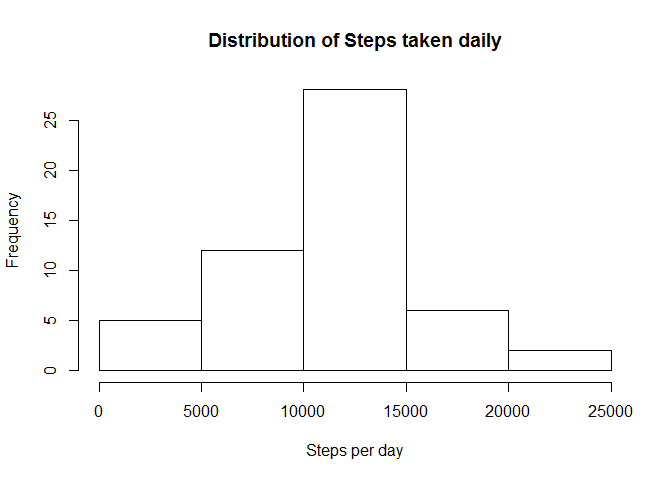
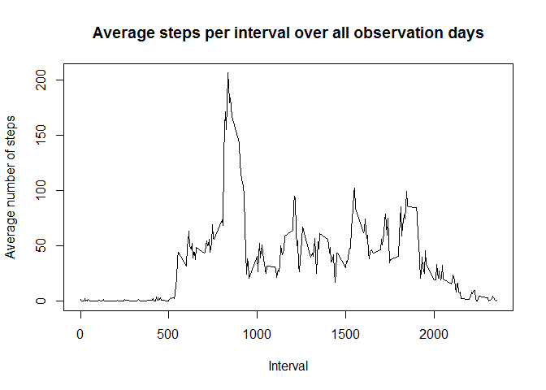
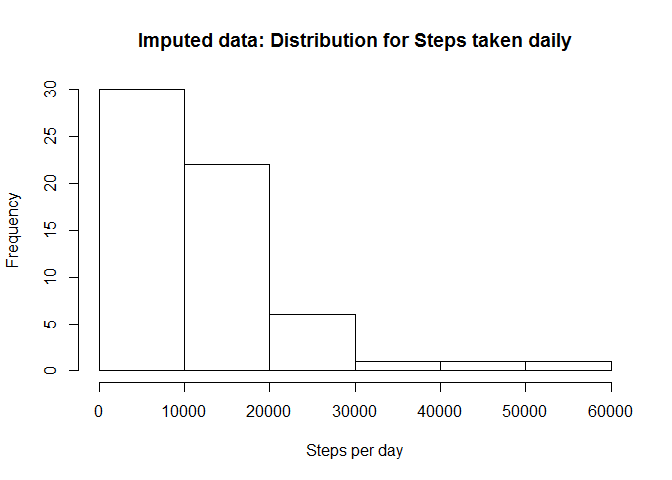
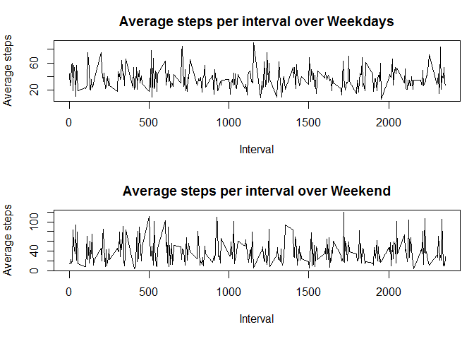

**Loading and preprocessing the data**
--------------------------------------

    setwd("C:/Users/egdbb48/ReproducibleResearch/Project1")
    activity <- read.csv(file="activity.csv",header = TRUE)
    head(activity)

    ##   steps       date interval
    ## 1    NA 2012-10-01        0
    ## 2    NA 2012-10-01        5
    ## 3    NA 2012-10-01       10
    ## 4    NA 2012-10-01       15
    ## 5    NA 2012-10-01       20
    ## 6    NA 2012-10-01       25

**Histogram of the total number of steps taken each day**
---------------------------------------------------------

    #Summarize steps per day
    DaySteps <- aggregate(steps~date,activity,sum)
    hist(as.numeric(DaySteps$steps),main="Distribution of Steps taken daily", xlab="Steps per day")

<!-- -->

**What are mean and median total number of steps taken per day?**
-----------------------------------------------------------------

### The Mean number is 1.076618910^{4}. The Median number is 10765 (see code below).

    #Mean of total steps taken daily
    meanDaySteps <- mean(DaySteps$steps)
    #Median of total steps taken daily
    medianDaySteps <- median(DaySteps$steps)

**What is the average daily activity pattern?**
-----------------------------------------------

### 1. Time series plot of the 5-minute interval steps - averaged across all days

    #Average steps for each interval averaged over all days
    IntervalSteps <- aggregate(steps~interval,activity,mean)
    # Plot for average steps per interval
    plot(IntervalSteps$interval, IntervalSteps$steps, type="l",
         main="Average steps per interval over all observation days", 
         xlab="Interval", ylab="Average number of steps") 

<!-- -->

### 2. Which 5-minute interval, on average across all the days, contains the maximum number of steps? Interval No 835 is the interval with largest average number of steps (see code below).

    #Interval with the largest average number of steps:
    MaxInterval <- IntervalSteps[as.numeric(which(IntervalSteps$steps == max(IntervalSteps$steps))),]$interval

**Imputing missing values**
---------------------------

### 1. Total number of missing values in the dataset is 2304 (see code below)

    MissingNo <- sum(is.na(activity$steps))

### 2. Strategy for filling in all of the missing values in the dataset.

My strategy is to substitute undefined values with the average the
corresponding interval.

### 3. Creating data set with imputed values.

    #Load raw data into new data frame where missing values will be substituted with averages per selected strategy 
    imputed <- read.csv(file="activity.csv",header = TRUE) 
    #Combine the new data frame with the data frame containing average daily steps for each interval into the interim data frame
    Merged = merge(activity, IntervalSteps, by="interval", suffixes=c(".activity", ".IntervalSteps"))
    #Use interim data frame to substitute missing values in the "raw"" data frame c
    imputed$steps = ifelse(is.na(Merged$steps.activity), Merged$steps.IntervalSteps, Merged$steps.activity)
    head(imputed)

    ##      steps       date interval
    ## 1 1.716981 2012-10-01        0
    ## 2 0.000000 2012-10-01        5
    ## 3 0.000000 2012-10-01       10
    ## 4 0.000000 2012-10-01       15
    ## 5 0.000000 2012-10-01       20
    ## 6 0.000000 2012-10-01       25

### 4. Histogram of the total number of steps taken each day

    DayStepsImputed <- aggregate(steps~date,imputed,sum)
    #sum(DayStepsImputed$steps)
    hist(as.numeric(DayStepsImputed$steps),main="Imputed data: Distribution for Steps taken daily", xlab="Steps per day")

<!-- -->

### Mean and median total number of steps taken per day are 1.076618910^{4} - mean and 1.035162310^{4} - median (see code below)

    #median steps per day:
    MedianSteps <- median(DayStepsImputed$steps)
    #mean steps per day:
    MeanSteps <- mean(DayStepsImputed$steps)

### Mean (average) number of steps did not change after imputing missing values, while the Median value increased - just as expected for the chosen imputing strategy.

**Activity patterns: average number of steps taken per 5-minute interval across weekdays and weekends**
-------------------------------------------------------------------------------------------------------

### 1. Added new column to the "filled in"" dataframe indicating whether day of observation belongs to working week days or to weekend.

    imputed$date <- as.Date(imputed$date)
    #create a vector of weekdays
    weekdays1 <- c('Monday', 'Tuesday', 'Wednesday', 'Thursday', 'Friday')
    imputed$wDay <- factor((weekdays(imputed$date) %in% weekdays1), 
                       levels=c(FALSE, TRUE), labels=c('weekend', 'weekday')) 

### 2. Prepared panel plot containing a time series plot of the 5-minute interval and the average number of steps taken, averaged across all weekday days or weekend days:

    # Calculate average steps per interval across Weekdays and for Weekend days
    IntervalStepsMeanWeekday <- aggregate(steps~interval, data=subset(imputed,wDay=='weekday'),mean)
    IntervalStepsMeanWeekend <- aggregate(steps~interval, data=subset(imputed,wDay=='weekend'),mean)
    # 2 figures arranged in 2 rows 
    par(mfrow=c(2,1),mar=c(5,4,3,1))
    plot(IntervalStepsMeanWeekday$interval, IntervalStepsMeanWeekday$steps, type="l", main="Average steps per interval over Weekdays",xlab="Interval", ylab="Average steps") 
    plot(IntervalStepsMeanWeekend$interval, IntervalStepsMeanWeekend$steps, type="l", main="Average steps per interval over Weekend",xlab="Interval", ylab="Average steps") 

<!-- -->

Are there differences in activity patterns between weekdays and weekends? Obviously there are - see the graph above.
--------------------------------------------------------------------------------------------------------------------
